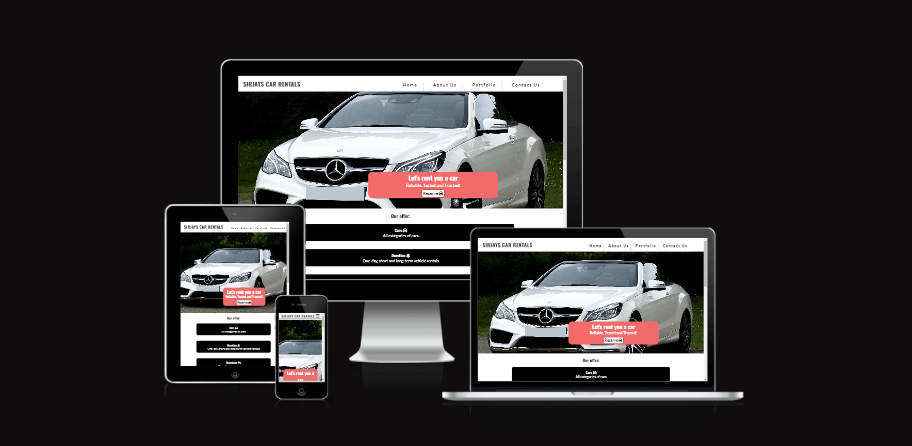
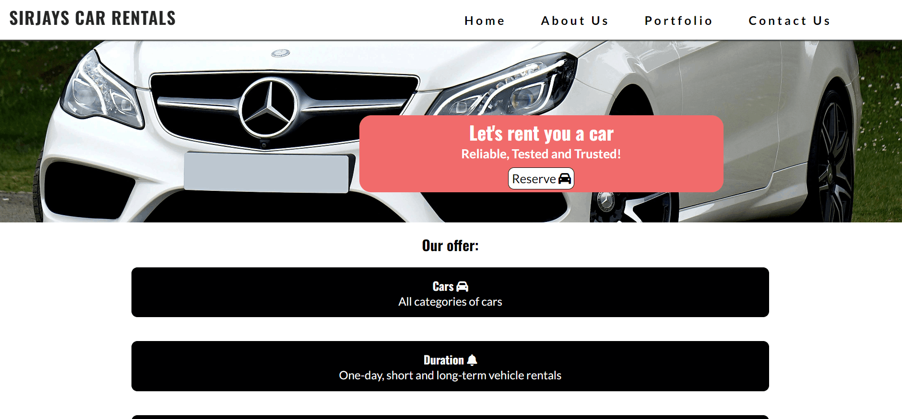
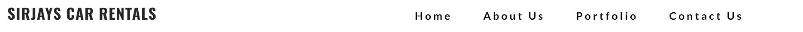
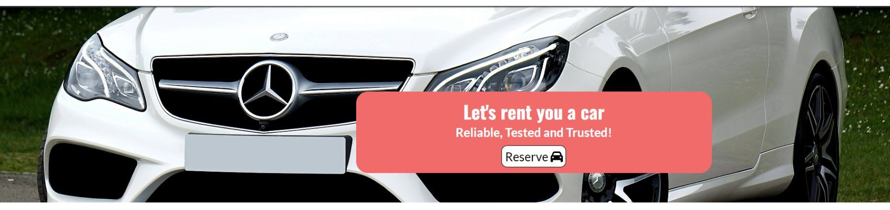
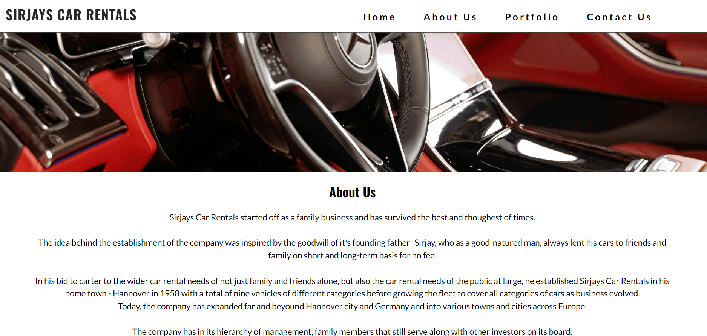
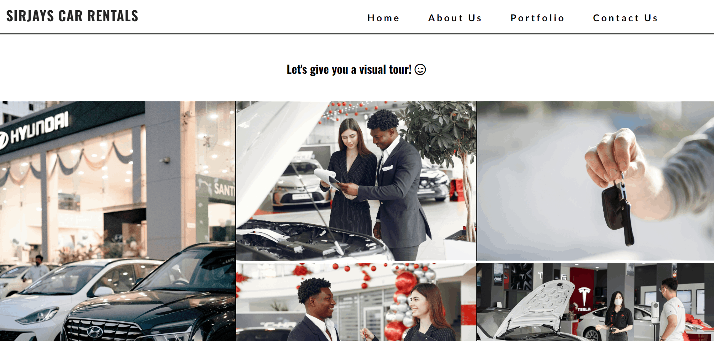
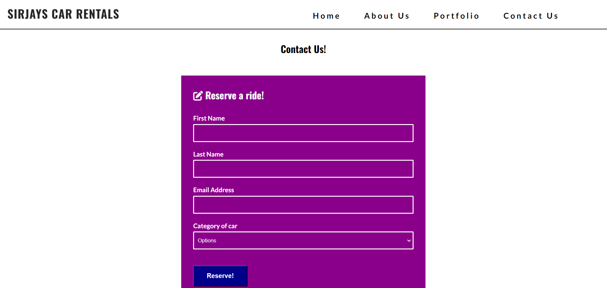
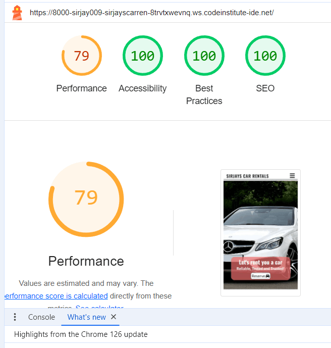

<h1>Sirjays Car Rentals</h1>

Sirjays Car Rentals website is a webpage dedicated to serving the everyday car rental needs of the general public.

<h3>User</h3>
<ul>
<li>As a user, i want to be able to find a car rental company in my locality to rent a car.</li>
<li>As a user, i want to be able to see what offers the car rental company have.</li>
<li>As a user, i want to be able to learn more about the company's history.</li>
<li>As a user, i want to be able to see virtual evidence of the company's business environment.</li>
<li>As a user, i want to be able to reserve a car online.</li>
<li>As a user, i want to be able to contact the car rental company online.</li>
<li>As a user, i want to be able to see the categories of cars in the company's fleet.</li>
<li>As a user, i want to be able to find out the business hours of the company.</li>
</ul>
<h3>Business Owner</h3>
<ul>
<li>As a business owner, i want to be able to showcase my business to the general public.</li>
<li>As a business owner, i want to be able to clearly present the various services my business is into.</li>
<li>As a business owner, i want to be able to assure prospective customers of the stability of my business through the company's history.</li>
<li>As a business owner, i want to be able to share pictorial evidence of the company's business environment and friendly/assist-ready staff.</li>
<li>As a business owner, i want to be able to provide a fast and easy means of contacting the company.</li>
<li>As a business owner, i want to be able to avail users of information of the categories of cars in the company's fleet.</li>
<li>As a buisness owner, i want to be able to present my business opening hours to users.</li>
</ul>
 

 

<h3>Features</h3>

In achieving the user and business owner goals, i have created a four pages website consisting of: Home, About Us, Portforlio and Contact Us.

<h3>Home page</h3>

<ul>
<li>The Home page section clearly details the essence and purpose of the company in the header.</li>
<li>A navigation section to access the pages of the website is nested in the header of the homepage.</li>
<li>The services the company offer are detailed in the body of the home page.</li>
<li>At the bottom of the page is the company's contact details, social media channels and business hours.</li>
</ul>
 

Navigation

<ul>
<li>The Navigation section of the project sits at the top of all file pages and houses the logo/company's name - Sirjays Car Rentals - on the left. This logo is clickable and brings users back to the home page.</li>
<li>On the right of the logo are the other navigation links to the other pages of the website. These include the About us, Portfolio and Contact sections.</li>
<li>The navigation appears at the top of all file pages and aids users to smoothly interact with all pages by simply clicking on any section they desire to visit.</li>
</ul>
 

The Header

<ul>
<li>The Header houses the hero image and a pink overlay with content that summarizes the essence and purpose of the webpage.</li>
<li>Users are also able to access directly the contact/reserve form from the header via a reserve button inserted in the overlay</li>
<li>To ensure user accessiblity, the header has been clearly set on a white background using black font colour.</li>
</ul>
</li>
 

<h3>The About Us Section</h3>

<ul>
<li>A navigation section to access the other pages of the website and also to return to the home page is nested at the top of the About Us page.</li>
<li>The About section tells the history of the company.</li>
<li>At the bottom of the page is the company's contact details, social media channels and business hours.</li>
</ul>
 

<h3>The Portfolio Section</h3>

<ul>
<li>A navigation section to access the other pages of the website and also to return to the home page is nested at the top of the Portfolio page.</li>
<li>The Portfolio section gives users a virtual tour of the company's customer-friendly business environment while displaying a couple of car varieties in its fleet.</li>
<li>At the bottom of the page is the company's contact details, social media channels and business hours.</li>
</ul>
 

<h3>The Contact Us Section</h3>

<ul>
<li>A navigation section to access the other pages of the website and also to return to the home page is nested at the top of the Contact Us page.</li>
<li>The Contact us section avails users of a contact/reservation form to use to do their bookings and contact the company.</li>
<li>At the bottom of the page is the company's contact details, social media channels and business hours.</li>
</ul>
</ul>
 

<h3>Technology Used</h3>

<strong>Html</strong>

<ul>
<li>I used this technology to structure my webpages.</li>
</ul>
 

<strong>CSS</strong>

<ul>
<li>I used this technology to style and add layouts to my project.</li>
</ul>
 

<strong>Font Awesome</strong>

<ul>
<li>I used this technology for all the icons in this project.</li>
</ul>
 

<strong>GoogleFonts</strong>

<ul>
<li>I used this techology for all the fonts used in this project.</li>
</ul>
 

<strong>Hubspot</strong>

<ul>
<li>I used this technology to create my favicon logo.</li>
</ul>
 

<strong>jpeg-optimizer.com</strong>

<ul>
<li>I used this technology to optimize the images i used in this project.</li>
</ul>
 

<h3>Testing</h3>

I manually tested this project to determine site usability, responsiveness and intuitivity to new users, by self and with the help of a few friends.

 

<h4>Testing phase</h4>
 
<h5>Testing for links and form</h5>
<table>
<tr>
    <th>Test</th>
    <th>Outcome</th>
  </tr>
   <tr>
    <td>All links on Navigation lead to their correct pages</td>
    <td>Pass</td>
  </tr>
  <tr>
    <td>Reserve button lead to contact form on contact us page</td>
    <td>Pass</td>
  </tr>
  <tr>
    <td>Footer social media links all lead to their respective social media sites</td>
    <td>Pass</td>
  </tr>
  <tr>
    <td>Contact form submits when all criteria is filled correctly</td>
    <td>Pass</td>
  </tr>
  <tr>
    <td>User prevented from submitting form without correct elements</td>
    <td>Pass</td>
  </tr>
  <tr>
    <td>Form validation presents when incorrect input type is entered</td>
    <td>Pass</td>
  </tr>
</table>
 

<h5>Testing for responsiveness</h5>
<table>
<tr>
    <th>Test</th>
    <th>Outcome</th>
  </tr>
   <tr>
    <td>Home page, about us, portfolio, contact us display correctly on screens larger than 950px</td>
    <td>Pass</td>
  </tr>
  <tr>
    <td>Home page, about us, portfolio, contact us display correctly on screens smaller than 950px</td>
    <td>Pass</td>
  </tr>
</table>
 

<h4>User testing</h4>
 
<h5>User testing challenge</h5>

5 users were tasked prior to visiting the web page to conduct under-stated basic testing and report on success or otherwise.

 
<table>
<tr>
    <th>Test</th>
    <th>Result</th>
  </tr>
   <tr>
    <td>Upon arrival to website please navigate to where you would expect to find a contact form</td>
    <td>100%</td>
  </tr>
  <tr>
    <td>Please navigate to the social media links of this business</td>
    <td>100%</td>
  </tr>
  <tr>
    <td>Please fill in contact form with your information and car category preference throught the reserve button</td>
    <td>100%</td>
  </tr>
  <tr>
    <td>Please navigate to the Portfolio page and count how many images there are</td>
    <td>100%</td>
  </tr>
</table>
 

<h5>User responsive testing</h5>

5 users were asked to view the website on their mobile devices and/or tablets to provide any feedback on errors or page overlapping issues.

 
<table>
<tr>
    <th>Test</th>
    <th>Result</th>
  </tr>
   <tr>
    <td>Issues reported</td>
    <td>None</td>
  </tr>
</table>
 

<h3>Bugs</h3>

Solved bugs

<ul>
<li>After deployment, my logo won't stop wrapping on mobile screens of width of 315px and below. I created a new media query for screens of max-width 315px and below to debug the problem</li>
<li>Navbar items kept wrapping on tablet screens even after i reduced it's font size. I debuged it using the code - whitespace : nowrap; - on the media query of tablets</li>
<li>Reserve forms could be submitted with no values using the space key. I debuged the issue using the code - pattern="[A-Za-z0-9]{1,20}"</li>
</ul>
 

<h3>Validator Testing</h3>
<ul>
<li>
HTML

<ul>
<li>The W3C validator-detected errors were corrected.</li>
<li>No errors were returned when re-ran on W3C validator after correction was effected.</li>
</ul>
</li>

<li>
CSS

<ul>
<li>No errors were returned when css style sheet was run on the official (Jigsaw) validator.</li>
</ul>
</li>

<li>
Accessibility

<ul>
<li>I confirmed that the colors and fonts chosen are easy to read and accessible by running it through lighhouse in devtools.</li>

</ul>
</li>

</ul>
 

<h3>Unfixed Bugs</h3>

No unfixed bugs

 

<h3>Deployment</h3>

The site was deployed to GitHub pages using the following steps:

<ul>
<li>Go to the settings tab of GitHub repository page</li>
<li>On the left-hand sidebar in the code and automation section, select pages</li>
<li>Set 'Source' to 'Deploy from Branch', select 'Main branch', set 'Folder' to 'Root', then click save</li>
<li>Click the 'Code<>' tab and wait a few minutes and then refresh repository</li>
<li>Go to the 'Environments' section on the right-hand side and click on 'github-pages'</li>
<li>Click on the URL displayed to see the live deployed site</li>
</ul>

The live link can be found here - https://sirjay009.github.io/Sirjays-Car-Rentals/index.html

 
<h3>Credits</h3>

Credit

<ul>
<li>The favicon link code was taken from https://www.w3schools.com</li>
<li>The navbar link code was taken from the CI love Running Project - https://sirjay009.github.io/love-running/</li>
<li>The code to debug navbar items that kept wrapping on tablet screen was taken from https://css-tricks.com</li>
<li>The code to debug contact/reserve form from accepting empty values was taken from https://stackoverflow.com</li>
<li>The code to make the reserve button in hero's overlay was taken from Alan Bushell's Belfast Auto Repairs project - https://alan-bushell.github.io/belfast-auto-repairs/index.html</li>
<li>The code to create space between text and font icons and debug footer was taken from https://wwwshecodes.io</li>
<li>The code to make the social media links was taken from both the CI Love Running Project and Alan Bushell's Belfast Auto Repairs project</li>
<li>Pieces of code for the general styling of the project was also taken from https://www.w3schools.com , https://www.codedamn.com , https://www.keentodesign.com and https://www.youtube.com/channel/UCvCyHScz5b1atuGYOQG_W8g</li>
</ul>

