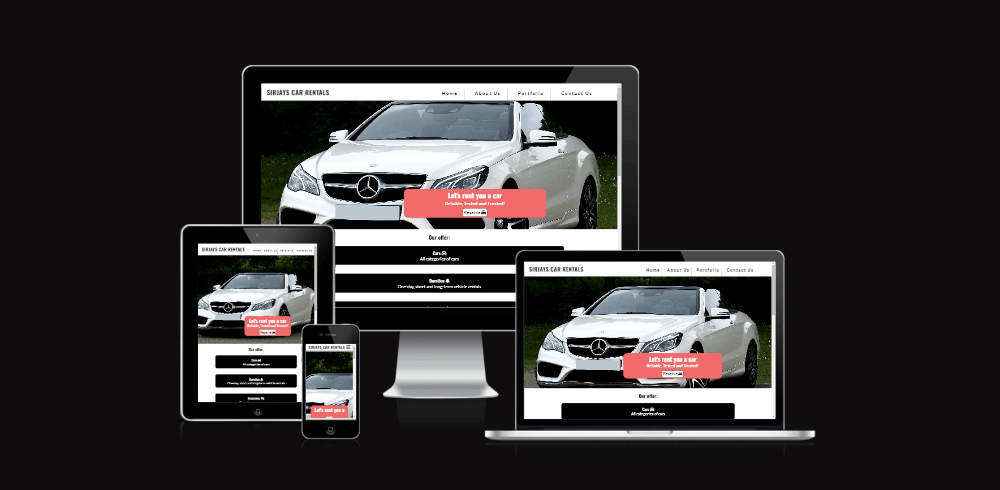
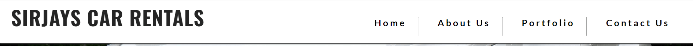
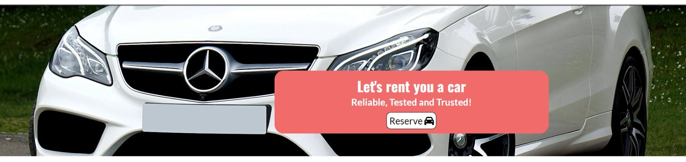
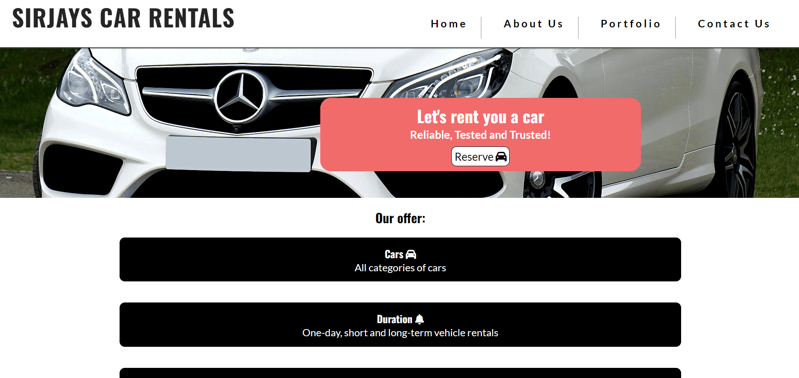
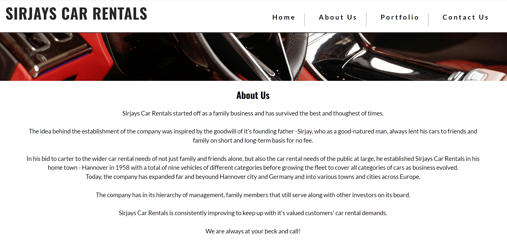
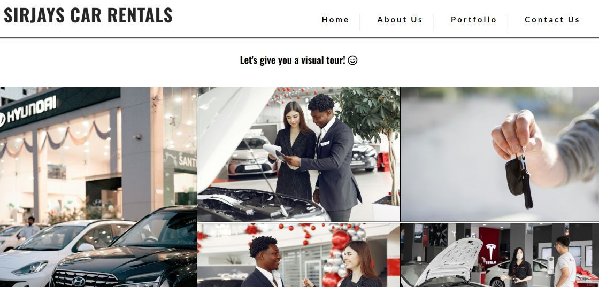
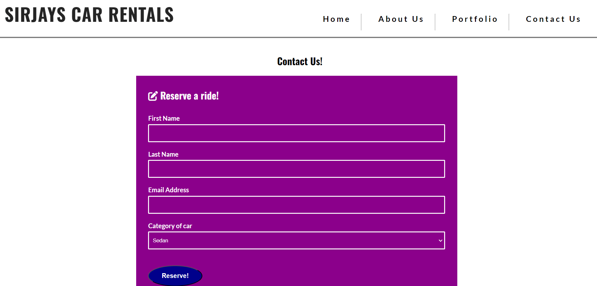

<h1>Sirjays Car Rentals</h1>

Sirjays Car Rentals website is a webpage dedicated to serving the everyday car rental needs of the general public.

As a car rental company, Sirjays Car Rental, offers the best of car varieties at a very affordable rate and in a very proffessional and customer-friendly business environment run by a team of experienced, dedicated and assist-ready staff.

Visitors of Sirjays Cars Rentals are able to avail themselves of all necessary information regarding services offered, categories of cars to choose from, a visual tour of Sirjays' customer- friendly business environment, a reservation form, information about business hours, company's contact address and social media channels.

<h3>Features</h3>

<ul>
<li>

<strong>Navigation</strong>

<ul>
<li>The Navigation section of the project sits at the top of all file pages and houses the logo/company's name - Sirjays Car Rentals - on the left. This logo is clickable and brings users back to the home page.</li>
<li>On the right of the logo are the other navigation links to the other pages of the website. These include the About us, Portfolio and Contact sections.</li>
<li>The navigation appears at the top of all file pages and aids users to smoothly interact with all pages by simply clicking on any section they desire to visit.</li>
</ul>
</li>

<li>

<strong>The Header</strong>

<ul>
<li>The Header houses the hero image and a pink overlay with content that summarizes the essence and purpose of the webpage.</li>
<li>Users are also able to access directly the contact/reserve form from the header via a reserve button inserted in the overlay</li>
<li>To ensure user accessiblity, the header has been clearly set on a white background using black font colour.</li>
</ul>
</li>

<li>

<strong>Home page</strong>

<ul>
<li>The Home page section clearly details the essence and purpose of the company in the header and the services the company offer in the body.</li>
<li>At the bottom of the page is the company's contact details, social media channels and business hours.</li>
</ul>
</li>

<li>

<strong>The About Us Section</strong>

<ul>
<li>The About section tells the history of the company.</li>
<li>At the bottom of the page is the company's contact details, social media channels and business hours.</li>
</ul>
</li>

<li>

<strong>The Portfolio Section</strong>

<ul>
<li>The Portfolio section gives users a virtual tour of the company's customer-friendly business environment while displaying a couple of car varieties in its fleet.</li>
<li>At the bottom of the page is the company's contact details, social media channels and business hours.</li>
</ul>
</li>

<li>

<strong>The Contact Us Section</strong>

<ul>
<li>The Contact us section avails users of a contact/reservation form to use to do their bookings and contact the company.</li>
<li>At the bottom of the page is the company's contact details, social media channels and business hours.</li>
</ul>
</li>
</ul>

<h3>Testing</h3>
<ul>
<li></li>
<li></li>
<li></li>
<li></li>
<li></li>
</ul>

<h3>Bugs</h3>

Solved bugs

<ul>
<li>Navbar items kept wrapping on tablet screens even after i reduced it's font size. I debuged it using the code - whitespace : nowrap; - on the media query of tablets</li>
<li>Reserve forms could be submitted with no values using the space key. I debuged the issue using the code - pattern="[A-Za-z0-9]{1,20}"</li>
<li></li>
<li></li>
<li></li>
</ul>

<h3>Validator Testing</h3>
<ul>
<li></li>
<li></li>
<li></li>
<li></li>
<li></li>
</ul>

<h3>Unfixed Bugs</h3>

No unfixed bugs

<h3>Deployment</h3>

The site was deployed to GitHub pages using the following steps:

<ul>
<li>Go to the settings tab of GitHub repository page</li>
<li>On the left-hand sidebar in the code and automation section, select pages</li>
<li>Set 'Source' to 'Deploy from Branch', select 'Main branch', set 'Folder' to 'Root', then click save</li>
<li>Click the 'Code<>' tab and wait a few minutes and then refresh repository</li>
<li>Go to the 'Environments' section on the right-hand side and click on 'github-pages'</li>
<li>Click on the URL displayed to see the live deployed site</li>
</ul>

The live link can be found here - https://sirjay009.github.io/Sirjays-Car-Rentals/index.html

<h3>Credits</h3>

Credit

<ul>
<li>The favicon link code was taken from https://www.w3schools.com</li>
<li>The navbar link code was taken from the CI love Running Project - https://sirjay009.github.io/love-running/</li>
<li>The code to debug navbar items that kept wrapping on tablet screen was taken from https://css-tricks.com</li>
<li>The code to debug contact/reserve form from accepting empty values was taken from https://stackoverflow.com</li>
<li>The code to make the reserve button in hero's overlay was taken from Alan Bushell's Belfast Auto Repairs project - https://alan-bushell.github.io/belfast-auto-repairs/index.html</li>
<li>The code to create space between text and font icons and debug footer was taken from https://wwwshecodes.io</li>
<li>The code to make the social media links was taken from both the CI Love Running Project and Alan Bushell's Belfast Auto Repairs project</li>
<li>Pieces of code for the general styling of the project was also taken from https://www.w3schools.com , https://www.codedamn.com , https://www.keentodesign.com and https://www.youtube.com/channel/UCvCyHScz5b1atuGYOQG_W8g</li>
</ul>

